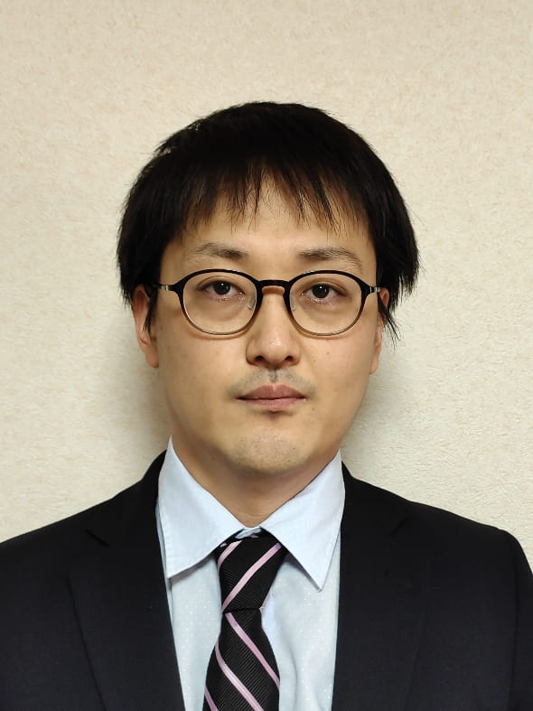

# 梅本 和希 (Kazuki UMEMOTO) 研究者情報

**更新日：2020/6/2**

本サイトでは，研究者情報・研究内容の紹介を行います．

制御工学とロボティクスの研究に従事，1986年3月生，長岡技術科学大学所属

連絡先：umemoto (アット) mech.nagaokaut.ac.jp

## 研究紹介 (in preparation)

* 非線形制御系のコンパクト集合上の安定解析
* 直列弾性アクチュエータを用いた多脚ロボットの力推定と制御
* クアッドロータ型UAVのロバスト制御

## 研究業績 Research Works

* [研究業績リスト List of research works](./?id=researchworks)

## 競争的資金

1. 科研費若手研究【代表】2020 – 2023， 多脚ロボットの衝突安全性を高めるための全身力覚センシングシステムの実現，
1. 科研費基盤研究(B)【分担】，2016 – 2018，橋梁長寿命化のためのワイヤ移動式汎用点検ロボットの開発
1. 共同研究【代表】，寄附金 (株式会社オリト)	2020年，林業ロボット実現のための六脚ロボットの歩行に関する研究等
1. 共同研究【代表】，研究奨学寄附金 (株式会社プラムネット)	2015年

[KAKENを見る](https://nrid.nii.ac.jp/nrid/1000010734428/)

## 学会・社会貢献活動

1. Program Committee, 14th Internatinal Symposium on Distributed Autonomous Robotic Systems (DARS2018), 2018.10.15-10.17
1. SCI'18 実行委員, システム制御情報学会, 2018.5.16-5.18
1. Program Committee, ICAMechS 2017, 2017.12.6-12.9
1. 会誌編集委員, 日本ロボット学会, 2017.4.1-2018.3.31
1. Program Committee, 13th Internatinal Symposium on Distributed Autonomous Robotic Systems (DARS2016), 2016.11.6-11.9
1. Program Committee, ICAMechS 2015, 2015.8.22-8.25
1. Program Committee, ICAMechS 2014, 2014.8.10-8.12

## 履歴書

### 職歴

* 2017年4月〜現在 長岡技術科学大学 機械創造工学専攻 助教
* 2014年4月〜2017年3月 神奈川大学 工学部 機械工学科 特別助教

### 学歴

* 2014年3月　京都大学大学院 工学研究科 機械理工学専攻 博士後期課程 修了 博士（工学），非線形システムのロバスト制御とマルチロータ型UAVへの応用
* 2010年3月　岡山大学大学院 自然科学研究科 機械理工学専攻 博士前期課程 修了 修士（工学），Control system design for nonlinear unstable plants with input saturation using robust right coprime factorization
* 2008年3月　岡山大学 工学部 システム工学科 卒業 学士（工学），ロバスト右既約分解に基づく水位プロセス実験装置に対するネットワーク制御系設計

### 所属学会

* RSJ（日本ロボット学会）2017年4月〜現在
* IEEE（The Institute of Electrical and Electronics Engineers）2014年6月〜現在
* ISCIE（システム制御情報学会）2014年5月〜現在
* SICE（計測自動制御学会）2012年1月〜現在

### 担当講義

#### 長岡技術科学大学

機械創造工学演習（設計）など in preparation

#### 神奈川大学 (過去に担当)

コンピュータ解析（1学年後期），MデザインA（1学年前期），MデザインC（2学年後期），FYS（First Year Seminar，1学年前期），機械工学実験（3学年後期）など

