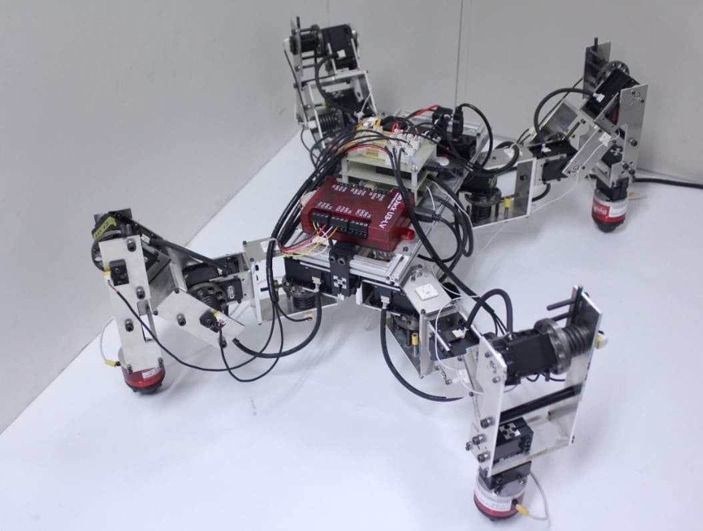

<!-- # トップページ -->

<!-- 
 -->
<h1 class="title has-text-centered">梅本研究室にようこそ</h1>

非線形システムのロバスト制御法と、そのロボットシステムへの応用を研究しています。

<!-- 
 -->
<!-- 画像は4:3で用意 -->

    

        

            

                <a href="#"><figure class="image">
                
                </figure></a>
            

            

                

橋梁点検ロボット
                

            

        </a>

    

    

        

            

                <a href="#"><figure class="image">
                
                </figure></a>
            

            

                

ドローンのロバスト自律制御
                

            

        </a>

    

    

        

            

                <a href="#"><figure class="image">
                
                </figure></a>
            

            

                

非周期的サンプル値非線形制御
                

            

        </a>

    

    

        

            

                <a href="#"><figure class="image">
                
                </figure></a>
            

            

                

外乱オブザーバに基づく制御
                

            

        </a>

    

    

        

            

                <a href="#"><figure class="image">
                
                </figure></a>
            

            

                

柔軟なアクチュエータを用いた多脚ロボット
                

            

        </a>

    

    
研究紹介の詳細は準備中です。

