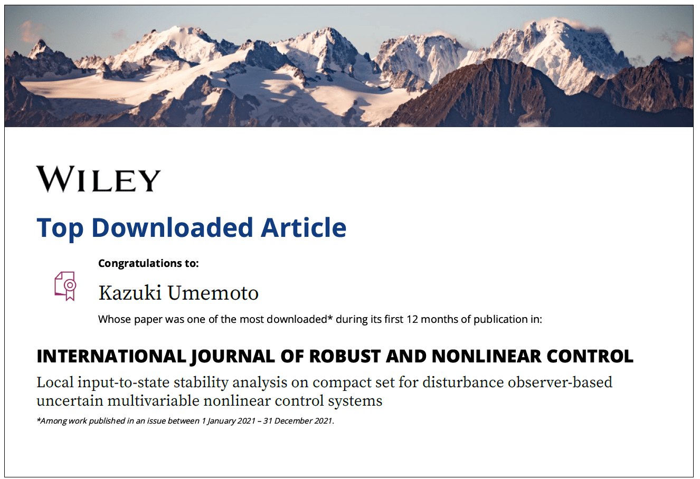

# 梅本 和希 研究者情報

* 制御工学とロボティクスの研究に従事，1986年3月生，福井大学所属
* 連絡先：umemoto (アット) g.u-fukui.ac.jp
* <a href="https://github.com/UmemotoCtrl" target="_blank">GitHub</a>
* [研究業績リスト List of research works](./?id=researchworks)

## 競争的資金

1. 公益財団法人 TAKEUCHI育英奨学会 研究助成【代表】，2025年度，力覚センサレス触覚推定ロボットグリッパー
1. 公益財団法人 前田工繊財団 2025年度 研究助成【代表】，2025年度，⼒覚センサレスなロボット触覚の⾼精度化
1. JST A-STEP 産学共同（本格型）【分担】、新触感インターフェースシステムによる新しい生活様式ソリューション、2022～2024年度，JST，A-STEP 産学共同（本格型），新触感インターフェースシステムによる新しい生活様式ソリューション
1. 科研費 若手研究【代表】2020～2023年度， 多脚ロボットの衝突安全性を高めるための全身力覚センシングシステムの実現
2. 科研費 基盤研究(B)【分担】，2016～2018年度，橋梁長寿命化のためのワイヤ移動式汎用点検ロボットの開発
3. 寄附金 (株式会社オリト)【代表】，2020年度，林業ロボット実現のための六脚ロボットの歩行に関する研究等
4. 研究奨学寄附金 (株式会社プラムネット)【代表】，2015年度

[KAKENを見る](https://nrid.nii.ac.jp/nrid/1000010734428/)

## 所属学会

* 日本機械学会 JSME 2024年7月〜現在
* 日本ロボット学会 RSJ 2017年4月〜現在
* IEEE（The Institute of Electrical and Electronics Engineers）2014年6月〜現在
* システム制御情報学会 ISCIE 2014年5月〜現在
* 計測自動制御学会 SICE 2012年1月〜現在

## 学会・社会貢献活動

1. 第63期 福井県担当幹事, 日本機械学会 北陸信越支部, 2025.4.1-2026.3.31
1. 第28, 29期運営委員, 計測自動制御学会 北陸支部, 2024.2.1-2026.1.31
1. Program Committee, SWARM2024, 2024.2.11-9.20
1. Local Committees, 8th International Conference on Control and Robotics Engineering (ICCRE 2023), 2023.4.21-4.23
1. Program Committee, AROB-ISBC-SWARM 2022, 2022.1.25-1.27
1. Executive Committee, DARS-SWARM2021, 2021.6.1-6.4
1. Program Committee, 14th Internatinal Symposium on Distributed Autonomous Robotic Systems (DARS2018), 2018.10.15-10.17
2. SCI'18 実行委員, システム制御情報学会, 2018.5.16-5.18
3. Program Committee, ICAMechS 2017, 2017.12.6-12.9
4. 会誌編集委員, 日本ロボット学会, 2017.4.1-2018.3.31
5. Program Committee, 13th Internatinal Symposium on Distributed Autonomous Robotic Systems (DARS2016), 2016.11.6-11.9
6. Program Committee, ICAMechS 2015, 2015.8.22-8.25
7. Program Committee, ICAMechS 2014, 2014.8.10-8.12

## 受賞

1. (指導学生の受賞) 計測自動制御学会 (SICE) 北陸支部優秀学生賞 上田 崇人、2024年度
2. (指導学生の受賞) 計測自動制御学会 (SICE) 北陸支部優秀学生賞 武野 駿斗、2024年度
3. Top Downloaded Article、Kazuki Umemoto, INTERNATIONAL JOURNAL OF ROBUST AND NONLINEAR CONTROL、Wiley、2021.

    

        <figure class="image is-full-width">
            
        </figure>
    

## 職歴

* 2023年4月〜現在 福井大学 学術研究院 工学系部門 機械工学講座 准教授
* 2017年4月〜2023年3月 長岡技術科学大学 機械創造工学専攻 助教
* 2014年4月〜2017年3月 神奈川大学 工学部 機械工学科 特別助教

## 学歴

* 2014年3月　京都大学大学院 工学研究科 機械理工学専攻 博士後期課程 修了 博士（工学），非線形システムのロバスト制御とマルチロータ型UAVへの応用
* 2010年3月　岡山大学大学院 自然科学研究科 機械システム工学専攻 博士前期課程 修了 修士（工学），Control system design for nonlinear unstable plants with input saturation using robust right coprime factorization
* 2008年3月　岡山大学 工学部 システム工学科 卒業 学士（工学），ロバスト右既約分解に基づく水位プロセス実験装置に対するネットワーク制御系設計

## 担当講義

### 福井大学での担当

創造演習Ⅰ・Ⅱ(3学年前・後期)，解析力学 (1学年後期)，制御システム (修士1学年前期)、先端機械設計演習 (3学年)

### 長岡技術科学大学での担当

機械創造工学設計（演習）（3学年1学期），機械創造工学総合演習入門（PBL 入門）（3学年1学期） ，国際情報技術演習（4学年1学期），機械の数学・力学演習（3学年1学期），機械工学基礎実験（2学年2学期）など

### 神奈川大学での担当

コンピュータ解析（1学年後期），MデザインA（1学年前期），MデザインC（2学年後期），FYS（First Year Seminar，1学年前期），機械工学実験（3学年後期）など
